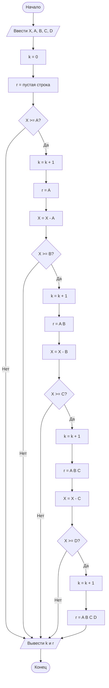

# Отчет по лабораторной работе № 1

#### № группы: ПМ-2602
#### Выполнила: Пильщикова Ирина Александровна
#### Вариант: 16

### Содержание

- [Постановка задачи](#1-постановка-задачи)
- [Входные и выходные данные](#2-входные-и-выходные-данные)
- [Выбор структуры данных](#3-выбор-структуры-данных)
- [Алгоритм](#4-алгоритм)
- [Программа](#5-программа)
- [Анализ правильности решения](#6-анализ-правильности-решения)


### 1. Постановка задачи

- Условия задачи

> Последовательность из четырех ванночек объемами A, B, C, D литров установлена в указанном порядке ступенькой (объем A — сверху). Ванночки установлены таким образом, что если в ванночку наливать воду больше ее объема, излишки будут стекать в следующую ванночку, установленную ниже (как каскадный водопад). Изначально все ванночки пусты. В верхнюю ванночку выливают воду объемом X литров. Какое количество ванночек окажется в результате полностью заполненным? Какие ванночки окажутся в результате полностью заполненными? На вход программы подаются натуральные числа X, A, B, C, D.

- Необходимо определить количество полностью заполненных ванночек и указать, какие именно ванночки будут заполнены.

Вода сначала попадает в первую ванночку `A`.

Если воды достаточно для заполнения ванночки `A`, она заполняется полностью, а оставшаяся вода переливается в ванночку `B`.

Аналогично после заполнения `B` лишняя вода поступает в `C`, а после заполнения `C` - в `D`.

Например, пусть:

`X = 65, A = 10, B = 20, C = 30, D = 40`.

Сначала заполняется ванночка `A`: `65 - 10 = 55`.

Остается 55 литров воды.

Затем заполняется ванночка `B`: `55 - 20 = 35`.

После этого заполняется ванночка `C`: `35 - 30 = 5`.

Для заполнения ванночки `D` необходимо 40 литров, но осталось только 5 литров.

Таким образом, полностью заполнены 3 ванночки: `A B C`.

### 2. Входные и выходные данные

На вход программы подаются пять натуральных чисел: `X`, `A`, `B`, `C`, `D`.

#### Входные данные

| Переменная | Тип данных | Min значение | Max значение | Назначение |
|---|---|---:|---:|---|
| `X` | `int` | `1` | `2147483647` | Объем воды, вылитой в верхнюю ванночку |
| `A` | `int` | `1` | `2147483647` | Объем первой ванночки |
| `B` | `int` | `1` | `2147483647` | Объем второй ванночки |
| `C` | `int` | `1` | `2147483647` | Объем третьей ванночки |
| `D` | `int` | `1` | `2147483647` | Объем четвертой ванночки |

Все входные данные являются натуральными целыми числами, поэтому для их хранения используется тип `int`.

Минимальное значение каждого входного параметра равно `1`.

Максимальное значение отдельно в условии задачи не указано. В программе используется тип `int`, поэтому максимальное положительное значение равно `2147483647`.

#### Выходные данные

Программа выводит количество полностью заполненных ванночек и их названия.

| Выходное значение | Тип данных | Возможные значения | Назначение |
|---|---|---|---|
| `k` | `int` | `0, 1, 2, 3, 4` | Количество полностью заполненных ванночек |
| `r` | `String` | `A`, `A B`, `A B C`, `A B C D` | Названия полностью заполненных ванночек |
| Сообщение при `k = 0` | `String` | `Нет полностью заполненных ванночек` | Выводится, если ни одна ванночка не заполнена полностью |

Так как вода переливается сверху вниз, возможны только последовательные наборы заполненных ванночек:

| Количество заполненных ванночек | Заполненные ванночки |
|---:|---|
| `0` | нет полностью заполненных ванночек |
| `1` | `A` |
| `2` | `A B` |
| `3` | `A B C` |
| `4` | `A B C D` |


### 3. Выбор структуры данных

Для решения задачи не требуется использование массивов, списков или других сложных структур данных, поскольку количество ванночек заранее известно и всегда равно четырем.

Все необходимые данные можно хранить в отдельных переменных.

| Переменная | Тип данных | Начальное значение | Назначение |
|---|---|---|---|
| `x` | `int` | вводится пользователем | Текущее количество воды. Сначала содержит весь объем воды, затем уменьшается после заполнения очередной ванночки |
| `a` | `int` | вводится пользователем | Объем ванночки `A` |
| `b` | `int` | вводится пользователем | Объем ванночки `B` |
| `c` | `int` | вводится пользователем | Объем ванночки `C` |
| `d` | `int` | вводится пользователем | Объем ванночки `D` |
| `k` | `int` | `0` | Количество полностью заполненных ванночек |
| `r` | `String` | `""` | Строка с названиями полностью заполненных ванночек |

Тип `int` выбран для переменных `x`, `a`, `b`, `c`, `d` и `k`, поскольку по условию задачи объемы воды и ванночек задаются натуральными целыми числами, а количество заполненных ванночек также является целым числом.

Для переменной `r` используется тип `String`, поскольку в ней необходимо хранить названия заполненных ванночек, например:

```text
A
A B
A B C
A B C D
```

Переменная `x` в процессе работы программы изменяется. После полного заполнения каждой ванночки из нее вычитается объем этой ванночки. Таким образом, в `x` всегда хранится количество воды, которое может перейти в следующую ванночку.

Переменная `k` первоначально равна `0`. При заполнении каждой очередной ванночки ее значение увеличивается на единицу.

Использование отдельных переменных является разумным для данной задачи, так как:

- количество ванночек фиксировано и равно четырем;
- сложные структуры данных не требуются;
- решение остается простым и понятным;
- такой способ хорошо соответствует последовательной проверке условий с помощью операторов `if`.

### 4. Алгоритм

Программа работает следующим образом:

1. Считывается количество воды `x`.
2. Считываются объемы четырех ванночек `a`, `b`, `c`, `d`.
3. Переменной `k`, хранящей количество заполненных ванночек, присваивается значение `0`.
4. Создается пустая строка `r`, в которой будут храниться названия заполненных ванночек.
5. Проверяется, выполняется ли условие `x >= a`.
6. Если воды достаточно:
   - ванночка `A` считается полностью заполненной;
   - значение `k` увеличивается на 1;
   - в строку `r` записывается `"A"`;
   - из `x` вычитается объем ванночки `a`.
7. Затем проверяется условие `x >= b`.
8. Если воды достаточно для второй ванночки:
   - значение `k` увеличивается;
   - в `r` записывается `"A B"`;
   - из оставшейся воды вычитается объем `b`.
9. Аналогичным образом проверяется заполнение ванночки `C`.
10. После заполнения `C` проверяется возможность полного заполнения ванночки `D`.
11. В конце программа выводит количество полностью заполненных ванночек и их названия.

Блок-схема алгоритма:



### 5. Программа

Полный текст программы с комментариями на русском языке:

```java
import java.io.PrintStream;
import java.util.Scanner;

public class Main {

    public static PrintStream out = System.out;

    public static void main(String[] args) {

        Scanner in = new Scanner(System.in);

        int x = in.nextInt(); // количество воды всего
        int a = in.nextInt(); // объем первой ванночки
        int b = in.nextInt(); // объем второй ванночки
        int c = in.nextInt(); // объем третьей ванночки
        int d = in.nextInt(); // объем четвертой ванночки

        int k = 0; // количество полностью заполненных ванночек
        String r = ""; // номера полностью заполненных ванночек

        // Проверяем, заполнится ли ванночка A
        if (x >= a) {

            k += 1; // увеличиваем количество заполненных ванн
            r = "A"; // добавляем название этой ванны
            x = x - a; // вычитаем из всего объема объем A

            // Проверяем, заполнится ли ванночка B
            if (x >= b) {

                k += 1; // увеличиваем количество заполненных ванн
                r = "A B"; // добавляем название этой ванны
                x = x - b; // вычитаем из оставшегося объема объем B

                // Проверяем, заполнится ли ванночка C
                if (x >= c) {

                    k += 1; // увеличиваем количество заполненных ванн
                    r = "A B C"; // добавляем название этой ванны
                    x = x - c; // вычитаем из оставшегося объема объем C

                    // Проверяем, заполнится ли ванночка D
                    if (x >= d) {

                        k += 1; // увеличиваем количество заполненных ванн
                        r = "A B C D"; // добавляем название этой ванны
                    }
                }
            }
        }

        // Вывод количества полностью заполненных ванночек
        out.println(k);

        // Вывод названий полностью заполненных ванночек
        if (k == 0) {
            out.println("Нет полностью заполненных ванночек");
        } else {
            out.println(r);
        }
    }
}
```


### 6. Анализ правильности решения

Для проверки правильности программы необходимо протестировать различные варианты количества воды.

В тестах используются объемы:

`A = 10, B = 20, C = 30, D = 40`.

Это позволяет проверить случаи, когда заполнено от 0 до 4 ванночек.


1. Тест: воды недостаточно для заполнения первой ванночки

- Input:

```text
5
10
20
30
40
```

- Output:

```text
0
Нет полностью заполненных ванночек
```

Воды всего 5 литров, а объем первой ванночки равен 10 литрам.

Условие:

`5 >= 10`

не выполняется.

Следовательно, ни одна ванночка полностью не заполнена.


2. Тест: полностью заполнена только ванночка A

- Input:

```text
10
10
20
30
40
```

- Output:

```text
1
A
```

Количество воды равно объему первой ванночки:

`10 = 10`.

Ванночка `A` заполняется полностью.

После этого воды не остается, поэтому ванночка `B` не заполняется.


3. Тест: полностью заполнены ванночки A и B

- Input:

```text
30
10
20
30
40
```

- Output:

```text
2
A B
```

После заполнения первой ванночки остается:

`30 - 10 = 20`.

Этого количества ровно хватает для заполнения ванночки `B`.

После заполнения `B` воды не остается.

Таким образом, полностью заполнены две ванночки.


4. Тест: полностью заполнены ванночки A, B и C

- Input:

```text
65
10
20
30
40
```

- Output:

```text
3
A B C
```

После заполнения `A` остается:

`65 - 10 = 55`.

После заполнения `B`:

`55 - 20 = 35`.

После заполнения `C`:

`35 - 30 = 5`.

Для заполнения `D` требуется 40 литров, поэтому четвертая ванночка полностью не заполняется.


5. Тест: полностью заполнены все ванночки

- Input:

```text
100
10
20
30
40
```

- Output:

```text
4
A B C D
```

Общий объем всех ванночек:

`10 + 20 + 30 + 40 = 100`.

Количество воды также равно 100 литрам.

Поэтому все четыре ванночки полностью заполнены.


6. Тест: воды больше, чем суммарный объем всех ванночек

- Input:

```text
150
10
20
30
40
```

- Output:

```text
4
A B C D
```

Для заполнения всех четырех ванночек требуется 100 литров.

Количество воды равно 150 литрам, поэтому все ванночки полностью заполняются, а оставшиеся 50 литров переливаются за пределы последней ванночки.

Программа корректно определяет, что количество полностью заполненных ванночек равно четырем.


